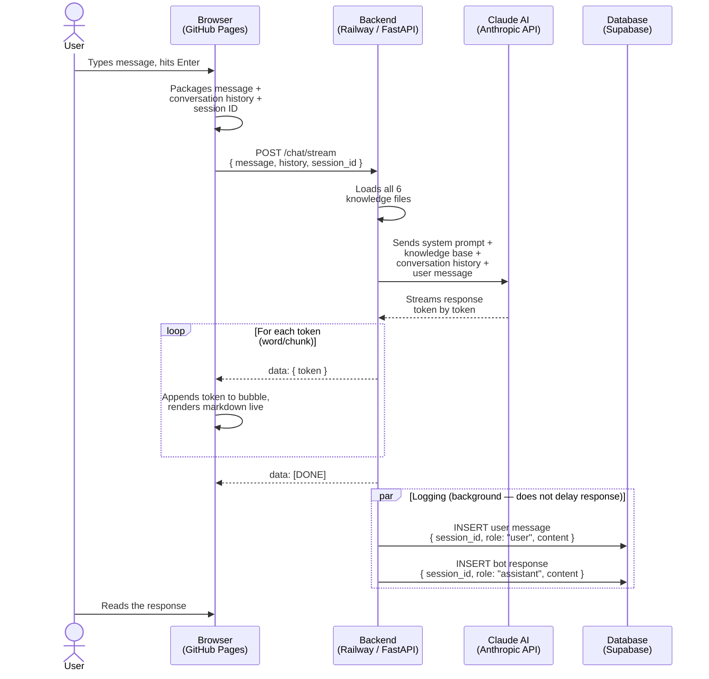

# Trinity CRE Bot — Architecture Overview

## What This System Does

The Trinity CRE Bot is an AI-powered chat assistant that lives on Burke's website. A visitor types a question about commercial real estate, the bot responds intelligently using Burke's knowledge base and Claude (Anthropic's AI model), and every conversation is saved to a database for later review.

---

## The Four Building Blocks

```
┌─────────────────┐     ┌─────────────────┐     ┌─────────────────┐
│   GitHub Pages  │────▶│    Railway      │────▶│  Anthropic API  │
│   (Frontend)    │◀────│   (Backend)     │◀────│   (Claude AI)   │
└─────────────────┘     └────────┬────────┘     └─────────────────┘
                                  │
                                  ▼
                         ┌─────────────────┐
                         │    Supabase     │
                         │  (Chat Logs DB) │
                         └─────────────────┘
```

### 1. GitHub Pages — The Frontend (what the user sees)
- Free static website hosting by GitHub
- Serves the chat interface: the green widget with the input box
- Runs entirely in the visitor's browser — no server needed
- Sends the user's message to the backend and displays the response as it streams in, word by word
- Generates a unique Session ID per browser visit, so each conversation can be tracked separately
- **Think of it as:** the storefront window — what Burke's visitors actually see and interact with

### 2. Railway — The Backend (the brain)
- A cloud server running Python 24/7
- Receives messages from the frontend, loads the knowledge base, calls Claude, and streams the reply back
- Also logs every message to Supabase in the background
- Restarts automatically if it ever crashes
- **Think of it as:** the back office — invisible to visitors, but doing all the work

### 3. Anthropic API — Claude AI (the intelligence)
- The actual AI model (Claude Sonnet) that generates responses
- The backend sends it: the conversation history + all of Burke's knowledge files + a detailed system prompt that defines Burke's persona, tone, and rules
- Claude reads all of that and generates a response, streaming it back one word at a time
- **Think of it as:** a highly knowledgeable associate who has read every article Burke has written and knows his entire playbook

### 4. Supabase — The Database (the log)
- Stores every message (user and bot) with a timestamp and session ID
- Free Postgres database hosted in the cloud
- Lets you query, filter, and export conversations anytime
- **Think of it as:** a call recording system — every conversation is saved so you can go back and review them

---

## The Knowledge Base

Burke's knowledge lives in six plain text files on the server. Every time a user sends a message, all six files are included in the prompt sent to Claude. Since Claude's context window is 200,000 tokens and these files total ~32KB, this works perfectly without any complex search system.

| File | What's in it |
|------|-------------|
| `overview.md` | Burke's background, credentials, contact info |
| `services.md` | Industrial, office, and investment sales services |
| `listings.md` | Current property listings |
| `insights.md` | All 12 blog articles with URLs and key data points |
| `faq.md` | Common questions and answers |
| `market.md` | Atlanta market context and data |

---

## Sequence Diagram — One Full Conversation Turn

This shows exactly what happens from the moment a user hits Send to when the response appears on screen.



---

## Cost & Infrastructure Summary

| Component | Provider | Plan | Monthly Cost |
|-----------|----------|------|-------------|
| Frontend hosting | GitHub Pages | Free | $0 |
| Backend server | Railway | Hobby | ~$5 |
| AI model | Anthropic (Claude) | Pay-per-use | ~$1–5 (low traffic) |
| Database | Supabase | Free | $0 |
| **Total** | | | **~$6–10/month** |

---

## How to Update the Bot's Knowledge

The bot's knowledge comes entirely from the markdown files in the `/knowledge` folder. To update anything Burke says:

1. Edit the relevant `.md` file in the GitHub repo
2. Push to `main`
3. Railway redeploys automatically (takes ~2 minutes)
4. The bot immediately reflects the changes

No reindexing, no vector databases, no ML pipelines — just edit a text file.
