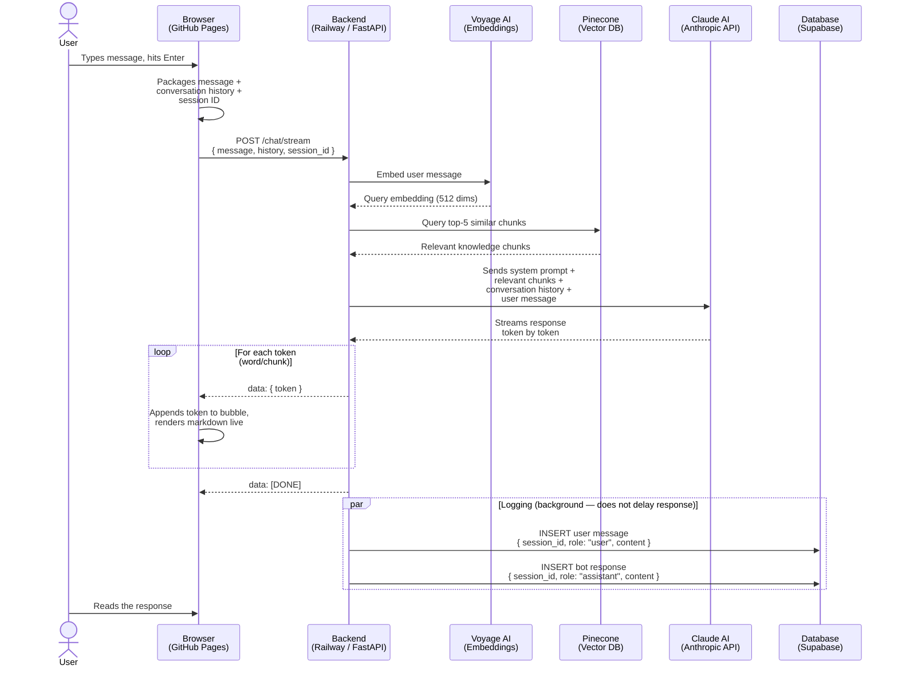

# Trinity CRE Bot — Architecture Overview

## What This System Does

The Trinity CRE Bot is an AI-powered chat assistant that lives on Burke's website. A visitor types a question about commercial real estate, the bot responds intelligently using Burke's knowledge base and Claude (Anthropic's AI model), and every conversation is saved to a database for later review.

---

## The Six Building Blocks

```
┌─────────────────┐     ┌─────────────────┐     ┌─────────────────┐
│   GitHub Pages  │────▶│    Railway      │────▶│  Anthropic API  │
│   (Frontend)    │◀────│   (Backend)     │◀────│   (Claude AI)   │
└─────────────────┘     └────────┬────────┘     └─────────────────┘
                                  │
                    ┌─────────────┼─────────────┐
                    │             │             │
                    ▼             ▼             ▼
           ┌─────────────┐ ┌─────────────┐ ┌─────────────┐
           │  Voyage AI  │ │   Pinecone  │ │   Supabase  │
           │ (Embeddings)│ │ (Vector DB) │ │ (Chat Logs) │
           └─────────────┘ └─────────────┘ └─────────────┘
```

### 1. GitHub Pages — The Frontend (what the user sees)
- Free static website hosting by GitHub
- Serves the chat interface: the green widget with the input box
- Runs entirely in the visitor's browser — no server needed
- Sends the user's message to the backend and displays the response as it streams in, word by word
- Generates a unique Session ID per browser visit, so each conversation can be tracked separately
- **Think of it as:** the storefront window — what Burke's visitors actually see and interact with

### 2. Railway — The Backend (the brain)
- A cloud server running Python 24/7
- Receives messages from the frontend, loads the knowledge base, calls Claude, and streams the reply back
- Also logs every message to Supabase in the background
- Restarts automatically if it ever crashes
- **Think of it as:** the back office — invisible to visitors, but doing all the work

### 3. Anthropic API — Claude AI (the intelligence)
- The actual AI model (Claude Sonnet) that generates responses
- The backend sends it: the conversation history + the most relevant knowledge chunks + a detailed system prompt that defines Burke's persona, tone, and rules
- Claude reads all of that and generates a response, streaming it back one word at a time
- **Think of it as:** a highly knowledgeable associate who has read every article Burke has written and knows his entire playbook

### 4. Voyage AI — The Embedding Service (the translator)
- Converts text into numerical fingerprints (embeddings) that capture meaning, not just keywords
- Used in two places: at setup to embed every knowledge chunk, and at query time to embed each user message so it can be compared against the knowledge base
- Runs as a remote API — no heavy model on the server, which keeps Railway's memory usage low
- **Think of it as:** a translator that converts both the question and the knowledge base into the same language so they can be compared

### 5. Pinecone — The Vector Database (the smart search index)
- Stores the knowledge base as numerical "fingerprints" (called embeddings) rather than raw text
- When a user asks a question, the backend converts it to the same fingerprint format, then finds the 3–5 most relevant knowledge chunks — without reading everything
- This means Claude only receives the specific context relevant to the question, not the entire knowledge base
- Scales well: a 10-page knowledge base and a 1,000-page knowledge base work the same way
- **Think of it as:** a very fast librarian who can find the most relevant pages from any book, without reading every page each time

### 6. Supabase — The Database (the log)
- Stores every message (user and bot) with a timestamp and session ID
- Free Postgres database hosted in the cloud
- Lets you query, filter, and export conversations anytime
- **Think of it as:** a call recording system — every conversation is saved so you can go back and review them

---

## The Knowledge Base

Burke's knowledge lives in six markdown files in the `/knowledge` folder. At setup, they are chunked into ~800-character pieces and indexed in Pinecone via Voyage AI embeddings. When a user sends a message, only the 5 most relevant chunks are retrieved and passed to Claude — not the entire knowledge base.

| File | What's in it |
|------|-------------|
| `overview.md` | Burke's background, credentials, contact info |
| `services.md` | Industrial, office, and investment sales services |
| `listings.md` | Current property listings |
| `insights.md` | All 12 blog articles with URLs and key data points |
| `faq.md` | Common questions and answers |
| `market.md` | Atlanta market context and data |

---

## Sequence Diagram — One Full Conversation Turn

This shows exactly what happens from the moment a user hits Send to when the response appears on screen.



---

## Cost & Infrastructure Summary

| Component | Provider | Plan | Monthly Cost |
|-----------|----------|------|-------------|
| Frontend hosting | GitHub Pages | Free | $0 |
| Backend server | Railway | Hobby | ~$5 |
| AI model | Anthropic (Claude) | Pay-per-use | ~$1–5 (low traffic) |
| Embeddings | Voyage AI | Free tier | $0 |
| Vector database | Pinecone | Free tier | $0 |
| Chat logs | Supabase | Free | $0 |
| **Total** | | | **~$6–10/month** |

---

## RAG — How the Vector Search Works

RAG stands for **Retrieval-Augmented Generation**. It's the technique that makes the bot actually knowledgeable rather than just making things up.

Without RAG, you'd have to paste the entire knowledge base into every Claude request — expensive, slow, and hits limits as the knowledge base grows.

With RAG, the flow is:

1. **At setup (one time):** Every knowledge document is split into chunks, converted into a numerical fingerprint (embedding), and stored in Pinecone
2. **At query time:** The user's question is converted into the same fingerprint format, and Pinecone finds the 3–5 most similar knowledge chunks in milliseconds
3. **Those chunks only** are passed to Claude as context — not the whole knowledge base

This is what makes the system scalable to multiple clients. Each client gets their own Pinecone index. The backend logic is identical.

### Why Voyage AI Instead of a Local Embedding Model

During initial development, the original embedding library (`fastembed`) required `onnxruntime` to run the model locally on the server. That library alone used 300–400 MB of RAM at startup — more than Railway's memory limit — causing the server to crash silently.

Voyage AI solves this by running the embedding model remotely. The backend makes a lightweight HTTP call, gets back a vector, and moves on. No large model loaded into server memory.

---

## How to Update the Bot's Knowledge

The bot's knowledge comes entirely from the markdown files in the `/knowledge` folder. To update anything Burke says:

1. Edit the relevant `.md` file
2. Re-run `ingest.py` to re-embed and reload into Pinecone (`cd backend && venv/bin/python3 ingest.py`)
3. Push to `main` — Railway redeploys automatically (~2 minutes)

The ingest step is required because the knowledge lives in Pinecone, not in the server's memory. It takes a few minutes depending on how many files changed.
